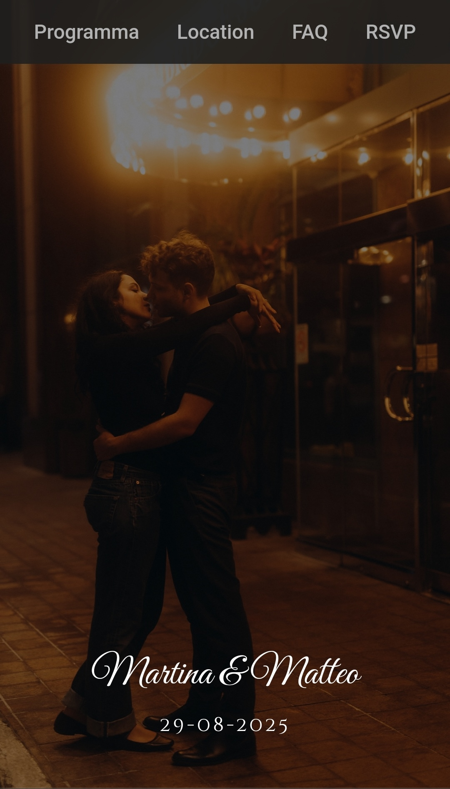
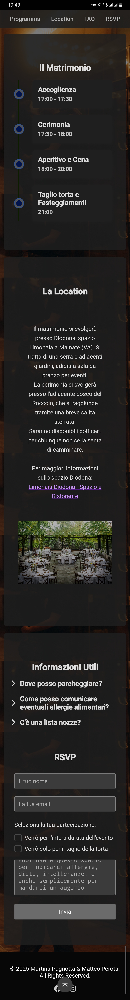

# Django Wedding Website

Hey there! 👋 Welcome to the repository for a Django wedding website I created for my wedding invites. 
This project is a simple, clean, and user-friendly website designed to give guests all the info they need about the big day. 

---

## **What’s This All About?**
This website is supposed to be the go-to spot for wedding details like the schedule, location, questions, and RSVP. 
The goal? To create something lean, easy to use, and reflective of the wedding style while making sure guests have a smooth experience.

---

## **Cool Features**

1. **Responsive Design**  
   - Works flawlessly on desktops, tablets, and phones.  
   - Flexbox and media queries make sure everything looks great, no matter the screen size.

2. **Pretty Visuals**  
   - A stunning fixed background image sets the tone, with a mobile-friendly fallback for better performance.  
   - Fancy fonts add a touch of elegance.

3. **Interactive Timeline**  
   - The event schedule is displayed as a sleek timeline with alternating blocks and dots.  
   - On mobile, it switches to a single-column layout for easy reading.

4. **Image Slideshow**  
   - A simple JavaScript slideshow shows off the wedding venue. Guests can click through the images manually.

5. **FAQ Section**  
   - Questions and answers are toggled with JavaScript, keeping things clean and interactive.  
   - Smooth transitions and icons make it fun to use.

6. **RSVP Form**  
   - A clean form lets guests RSVP, choose their attendance level, and add notes (like dietary needs).
   - Feedback is collected and sent over email to a dedicated email address I created to track RSVP.
   - Custom radio buttons and inputs keep everything looking consistent.

7. **Copy-to-Clipboard Feature**  
   - Guests can copy the couple’s IBAN for wedding gifts with a single click. A handy alert confirms it worked.

---

## **Tech Stuff**
Here’s what’s under the hood:  
- **HTML5 & CSS3**: Semantic HTML and modern CSS (Flexbox, animations, etc.) for structure and style. I'm not an expert in neither of the two languages, gen AI helped a bit here ;D
- **JavaScript**: Powers the slideshow, FAQ toggles, and clipboard feature.  
- **Django Template Tags**: The `` tag loads static files (images, CSS, etc.) for easy deployment.  
- **Responsive Images**: Optimized and lazy-loaded for faster performance.  
- **Accessibility**: ARIA labels, semantic HTML, and keyboard-friendly navigation make the site inclusive.

---

## **Design Vibes**
The design is all about simplicity, elegance, and usability.
- **Colors**: Neutral tones (white, soft grays) let the content shine against the background.  
- **Fonts**: A mix of serif (`Great Vibes`, `Cinzel Decorative`) and sans-serif (`Roboto`) fonts balances elegance with readability.  
- **Spacing**: Plenty of whitespace and padding keep things clean and easy to navigate.  
- **Mobile-First**: Designed with mobile users in mind, as most visitors will visit the website after scanning the QR code on the invites. It must look good on smaller screens.

---

## **How to Run It**
Want to check it out locally? Here’s how:  
1. Clone the repo to your machine.  
2. Make sure you have Django installed (`pip install django`).
3. Proceed to configure your Django project and repo.
4. Run the Django dev server:  
   ```bash
   python manage.py runserver
   ```
5. Open your browser and head to http://127.0.0.1:8000/ to see the site in action.

## **Publish it**

If you want to publish your website to let other people visit it, a viable way is to use cloud-based platforms that allows users to code, run, and host Python applications such as pythonanywhere.com.
<br>The procedure upload your code into the platform and publish your website is pretty straightforward and there's tons of materials on youtube for you to follow.

Once the website is live, you can just take your url and convert it to QR code if you want to use it in your invites.

---

## **This is how it looks like:**
<div style="width: 100%; height: 300px; overflow-y: auto;">
  
</div>
<div style="width: 100%; height: 300px; overflow-y: auto;">
  
</div>

## **That's all folks!**
Thanks for checking out this project! If you have any questions or feedback, feel free to reach out. 😊
